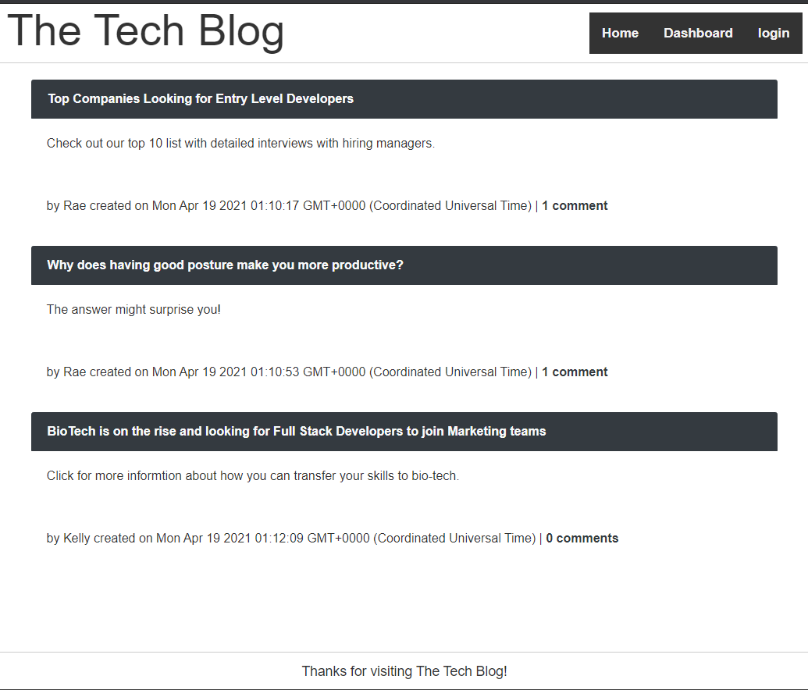

# Tech Blog MVC

### Description
_____________________________
The Tech Bog is a MVC model project where you can add a post, comment and view other's activities.

### Table of Contents
_____________________________
* [Installation](#installation)
* [Usage](#usage)
* [Questions](#questions)

### Installation
_____________________________
There are no special installation instructions, simply click the link below:

[The Tech Blog](https://afternoon-spire-65125.herokuapp.com/)

### Usage
_____________________________
*Instructions and example for use:*

If you visit our site and are not logged in, you will still be able to view current blog topics.  This is the view you will see:

If you log in, you will be able to create a new blog topic and comment on other user's blogs.

### Questions
_____________________________

  Please click on the link provided to access the author's [Github](http://github.com/RaeStichter).
  

  Further questions can be directed the the author's email address: rae@mail.com.
  